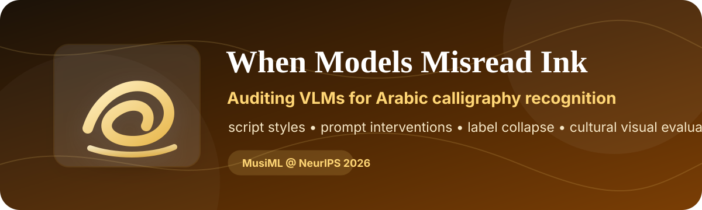
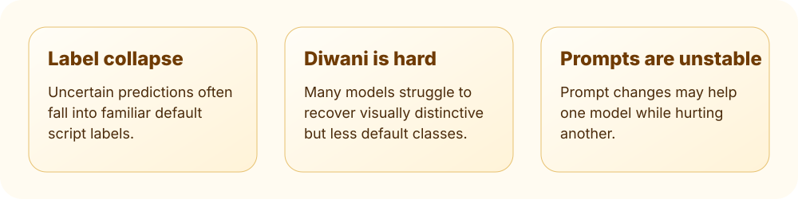

<p align="center">
  
</p>

<h1 align="center">When Models Misread Ink</h1>

<p align="center">
  <strong>Auditing VLMs for Arabic Calligraphy Recognition</strong>
</p>

<p align="center">
  <a href="https://github.com/NiazTahi/When-Models-Misread-Ink"></a>
  
  
  
</p>

This repository accompanies the MusIML@NeurIPS 2026 paper **When Models Misread Ink: Auditing VLMs for Arabic Calligraphy Recognition**. The project asks a simple but revealing question: when shown Arabic calligraphy, do VLMs recognize the visual script style, or do they collapse uncertain images into familiar labels?

<p align="center">
  
</p>

## What this repository contains

```text
prompts/     Prompt variants used in the calligraphy recognition audit
scripts/     Model runners, scoring code, aggregation utilities, and paper-figure builders
```

The repository is organized as a paper artifact for rerunning model evaluations, scoring responses, and regenerating analysis tables/figures.

## Paper snapshot

- **Problem.** Fine-grained Arabic calligraphy recognition is culturally important and visually difficult.
- **Audit setup.** VLMs are tested under numeric, visual-cue, and Diwani-first prompt interventions.
- **Main finding.** Models often collapse predictions into default labels, especially Thuluth, while Diwani remains difficult.
- **Practical message.** Prompting can move errors around, but it does not reliably repair visual discrimination.

## Setup

```bash
git clone https://github.com/NiazTahi/When-Models-Misread-Ink.git
cd When-Models-Misread-Ink
python -m venv .venv
source .venv/bin/activate  # Windows: .venv\Scripts\activate
pip install -r requirements.txt
```

API-based scripts read credentials from environment variables or local key files. Do not commit private credentials.

## Main scripts

| Purpose | Script |
|---|---|
| OpenAI/Gemini API inference | `scripts/run_gemini_calligraphy.py`, `scripts/gemini_batch_calligraphy.py` |
| Qwen-VL family inference | `scripts/run_qwen_vl_family_calligraphy.py` |
| InternVL inference | `scripts/run_internvl_calligraphy.py` |
| MiniCPM inference | `scripts/run_minicpm_calligraphy.py` |
| Gemma inference | `scripts/run_gemma4_calligraphy.py` |
| Scoring | `scripts/score_calligraphy_results.py` |
| Unified analysis | `scripts/make_unified_calligraphy_analysis.py` |
| Paper assets | `scripts/make_paper_assets.py` |

## Reproducibility notes

- Open-weight model runs use deterministic decoding where supported.
- Prompt variants are versioned in `prompts/`.
- Scoring code separates model parsing, label normalization, and aggregate metrics.
- Paper assets are generated from the unified analysis pipeline.

## Citation

If you use this repository, please cite:

```bibtex
@inproceedings{abtahi2026misreadink,
  title     = {When Models Misread Ink: Auditing VLMs for Arabic Calligraphy Recognition},
  author    = {Abtahi, Niaz Mohaiman and Maksud, Evan and Shahid, Reyana},
  booktitle = {NeurIPS 2026 Workshop on Muslims in ML},
  year      = {2026}
}
```

## Contact

Correspondence: [tahiniaz@gmail.com](mailto:tahiniaz@gmail.com)
